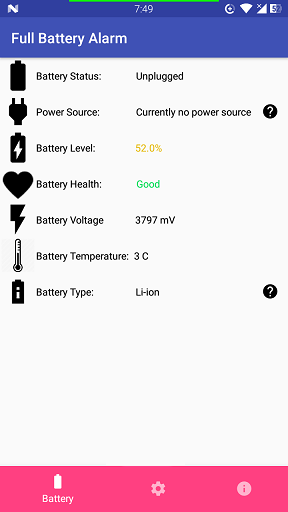

# Full Battery Alarm™

[](https://travis-ci.org/aircatcher/FullBatteryAlarm)
[](https://circleci.com/gh/aircatcher/FullBatteryAlarm)



## Getting Started

_Follow these instructions to build and run the project without data; note that
the app will be blank ._

1. Clone this repository.
2. Download the appropriate [JDK](http://www.oracle.com/technetwork/java/javase/downloads/jdk8-downloads-2133151.html)
for your system. We are currently on JDK 8.
3. [Install Android Studio](https://developer.android.com/sdk/index.html).
4. Import the project. Open Android Studio, click `Open an existing Android
   Studio project` and select the project. Gradle will build the project.
5. Clean Build the project. Click `Build > Clean Build`.
6. Run the app. Click `Run > Run 'app'`. After the project builds you'll be
   prompted to build or launch an emulator.

## Want to Contribute?

You can ask for our github contribution at mailto:ferickwar@gmail.com
Don't forget to fork us!

## License

```
Copyright 2017 Fandrew.XYZ

Licensed under the  the Apache Software License, Version 2.0 ("Apache 2.0");
you may not use this file except in compliance with the License.
You may obtain a copy of the License at

    http://www.apache.org/licenses/LICENSE-2.0

Unless required by applicable law or agreed to in writing, software
distributed under the License is distributed on an "AS IS" BASIS,
WITHOUT WARRANTIES OR CONDITIONS OF ANY KIND, either express or implied.
See the License for the specific language governing permissions and
limitations under the License.
```
